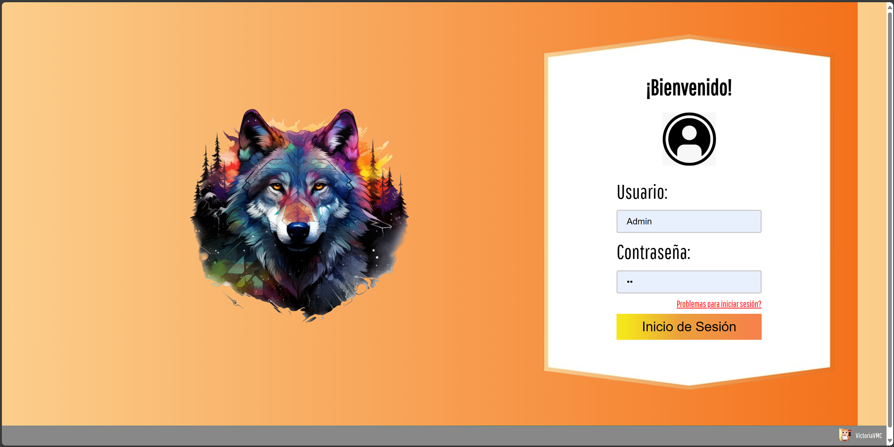

# PreParcial-PHP

El sistema debe permitir al jefe:
+ Tener su propia cuenta para ingresar al sistema.
+ Poder modificar la contraseña cuando lo requiera.
+ Registrar nuevos empleados con información:
    Empleados:
    - Nombre
    - Apellido
    - Cuit
    - Fecha de Nacimiento
    - Dirección (Barrio, Calle, Altura)
    - Salario
    - Puesto
    - Fecha de Ingreso
+ Actualizar la información de los empleados.
+ Eliminar empleados del sistema.
+ Consultar y Visualizar la información de los empleados.
+ Enviar mails para ver el codigo de Olvido (Video para configurar https://youtu.be/8r6ftznAQp4?si=X2G7Buffokg08keh)

# Login

